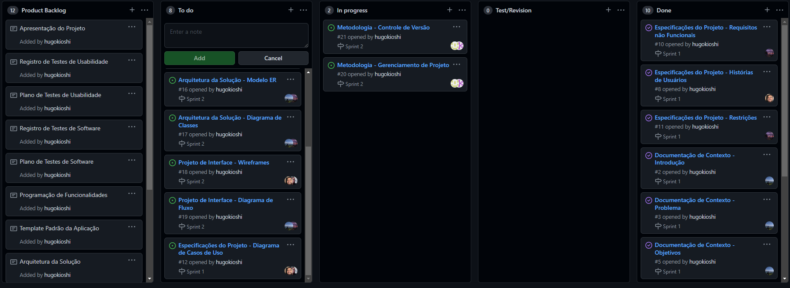
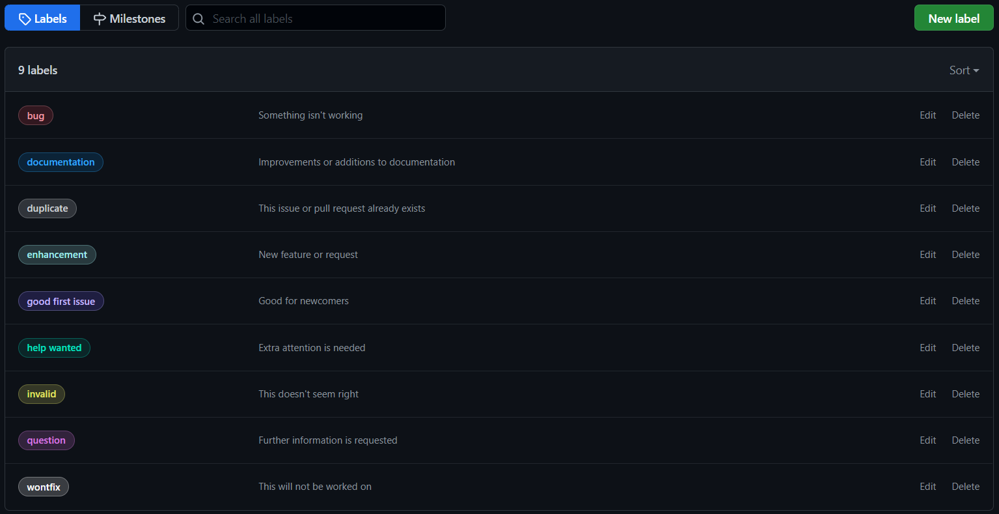

# Metodologia

Pré-requisitos: <a href="2-Especificação do Projeto.md"> Documentação de Especificação</a>

A  metodologia  contempla  as  definições  de  ferramental  utilizado  pela  equipe  tanto  para  a manutenção dos códigos e demais artefatos quanto para a organização do time na execução das tarefas do projeto.

## Relação de Ambientes de Trabalho
Os artefatos do projeto são desenvolvidos a partir de diversas plataformas e a relação dos ambientes com seu respectivo propósito é apresentada na tabela que se segue.

Ambiente  | Plataforma  | Link de Acesso
--------- | ----------- | ---------------
Repositório de código fonte  | GitHub  | https://github.com/ICEI-PUC-Minas-PMV-ADS/pmv-ads-2022-1-e2-proj-int-t6-atencao_psicossocial
Documentos do projeto        | GitHub  | https://github.com/ICEI-PUC-Minas-PMV-ADS/pmv-ads-2022-1-e2-proj-int-t6-atencao_psicossocial/tree/main/docs
Projeto de Interface e  Wireframes | Figma | https://www.figma.com/
Gerenciamento do Projeto  | GitHub  | https://github.com/ICEI-PUC-Minas-PMV-ADS/pmv-ads-2022-1-e2-proj-int-t6-atencao_psicossocial/projects/4

## Controle de Versão
A ferramenta de controle de versão adotada no projeto foi o Git, sendo que o Github foi utilizado para hospedagem do repositório.

Para gestão do código fonte do software desenvolvido, o grupo utiliza um processo baseado no Git Flow, como mostra a Figura 1. Desta forma, todas as manutenções no código são realizadas em branches separados, identificados como Hotfix, Release, Develop e Feature.  

Figura 1 Fluxo de controle do código fonte no repositório git

O projeto segue a seguinte convenção para o nome de branches:

- `main`: versão estável já testada do software
- `unstable`: versão já testada do software, porém instável
- `testing`: versão em testes do software
- `dev`: versão de desenvolvimento do software
Quanto à gerência de issues, o projeto adota a seguinte convenção para etiquetas:

- `documentation`: melhorias ou acréscimos à documentação
- `bug`: uma funcionalidade encontra-se com problemas
- `melhoria`: uma funcionalidade precisa ser melhorada
- `implementação`: uma nova funcionalidade precisa ser introduzida
- `design`: definições de UI e template da aplicação

> **Links Úteis**:
> - [Tutorial GitHub](https://guides.github.com/activities/hello-world/)
> - [Git e Github](https://www.youtube.com/playlist?list=PLHz_AreHm4dm7ZULPAmadvNhH6vk9oNZA)
>  - [Comparando fluxos de trabalho](https://www.atlassian.com/br/git/tutorials/comparing-workflows)
> - [Understanding the GitHub flow](https://guides.github.com/introduction/flow/)
> - [The gitflow workflow - in less than 5 mins](https://www.youtube.com/watch?v=1SXpE08hvGs)

## Gerenciamento de Projeto

### Divisão de Papéis

A equipe utiliza metodologias ágeis, tendo escolhido o Scrum como base para definição do processo de desenvolvimento.
Sendo assim, o time está organizado da seguinte maneira:

* _Scrum Master_: Augusto Hiroshi Santos Inanobe
* _Product Owner_: Luiz Felipe Vitor
* _Developer:
 -Naiara Julieta Maria Carvalho Mafra
-Augusto Hiroshi Santos Inanobe
-Luiz Felipe Vitor
-Hugo Kioshi
-Junior Antunes
-Samuel Leite Fonseca
-Thiago Álvaro Barbosa Fraga

### Processo
Para organização e distribuição das tarefas do projeto, a equipe está utilizando o Projects do github estruturado com as seguintes listas:
* **Product Backlog** : recebe as tarefas a serem trabalhadas conforme cronograma e os entregáveis. Todas as atividades identificadas no decorrer do projeto também devem ser incorporadas a esta lista;
* **To Do** : Esta lista representa o Sprint Backlog. Este é o Sprint atual que estamos trabalhando;
* **In Progress** : Quando uma tarefa tiver sido iniciada, ela é movida para cá;
* **Test/Revision** : Checagem de Qualidade;
* **Done** : nesta lista são colocadas as tarefas que passaram pelos testes e controle de qualidade e estão prontos para ser entregues ao usuário. Não há mais edições ou revisões necessárias, ele está agendado e pronto para a ação;

O quadro kanban do grupo no Projects está disponível através da URL https://github.com/ICEI-PUC-Minas-PMV-ADS/pmv-ads-2022-1-e2-proj-int-t6-atencao_psicossocial/projects/4 e é apresentado, no estado atual, na Figura 2.

*Figura 2 – Fluxo de controle do código fonte no repositório git* 

\
  AS tarefas são classificadas em função da natureza ou prioridade da atividade e seguem o um esquema de etiquetagem entre cores e categorias que pode ser visto pela Figura 3:

  

  *Figura 3 – Tela de etiquetas do quadro kanban no Github*

### Ferramentas

As ferramentas empregadas no projeto são:

- Editor de código: Visual Studio.
- Ferramentas de comunicação: Microsoft Teams, Google Meet.
- Ferramentas para criação de diagramas: astah, lucidchart, StarUML, Draw.io.
- Ferramentas de desenho de tela (wireframing): Figma.

O editor de código foi escolhido porque ele possui integração com o sistema de versão e permite depuração na máquina local. A ferramenta de comunicação utilizada foi recomendada pela Universidade e é bem completa para gestão de equipes e viabiliza chamadas de áudio, vídeo e conversa por chat. Para criar diagramas utilizamos as ferramentas mencionadas porque cada uma delas capta melhor algumas das necessidades da nossa solução. Por fim, a ferramenta escolhida para o desenvolvimento dos wireframes e interface de usuário foi escolhida por permitir a edição colaborativa, além de ter funcionalidades voltadas especificamente para a natureza deste trabalho.
